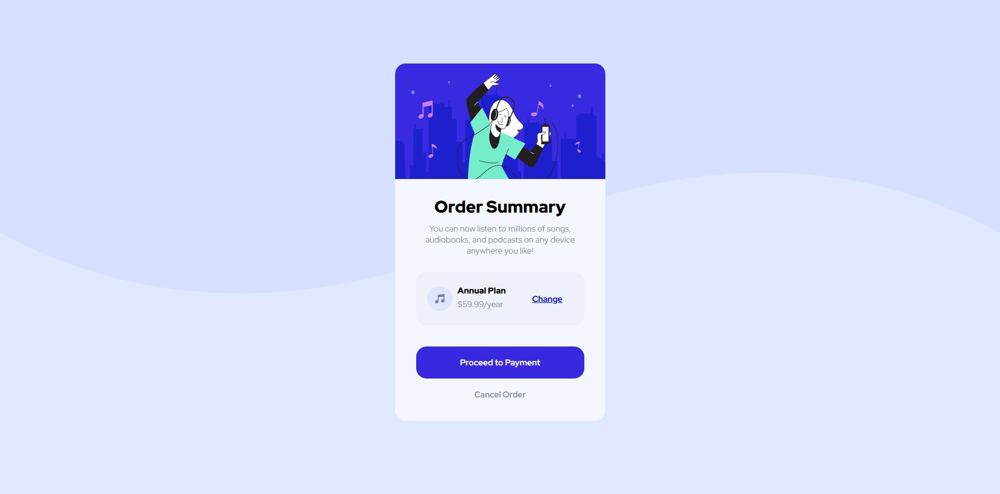

# Frontend Mentor - Order summary card solution
## Table of contents

- [Overview](#overview)
  - [Screenshot](#screenshot)
  - [Links](#links)
- [My process](#my-process)
  - [Built with](#built-with)

## Overview

### The challenge

### Screenshot

### Links

- Solution URL:(https://github.com/HaseebaAlhaddi/Frontend-Mentor-Order-summary-card)
- Live Site URL:(https://your-live-site-url.com)

## My process

### Built with

- Semantic HTML5 markup
- CSS custom properties
- Flexbox

